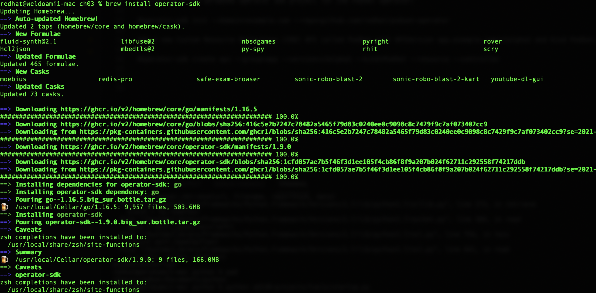
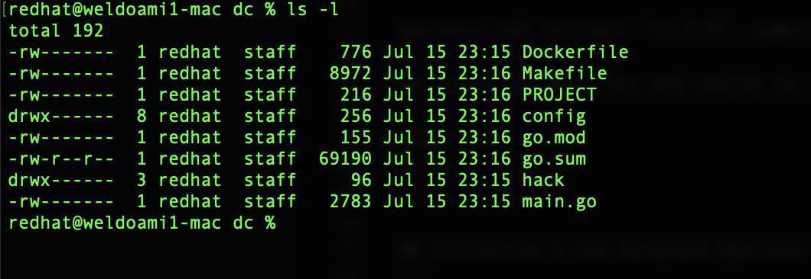

# Introduction
This is a quick demo about K8s Operator.
Operators in simple terms is nothing more than K8s resource and controller combination.
Controller watches the resource within its control loops, and every time the controller will compare the resource current state with the desired state, and in case of any differences, immerdiately the controller will bring the resource back to the desired state.

The Operator Framework includes:
Operator SDK: Enables developers to build operators based on their expertise without requiring knowledge of Kubernetes API complexities.
Operator Lifecycle Management: Oversees installation, updates, and management of the lifecycle of all of the operators running across a Kubernetes cluster.
Operator Metering: Enables usage reporting for operators that provide specialized services.

Why Operators are important
They simply provide a complete lifecycle mangement from installation all the way to Day2 Ops, and this happed by modeling the human experience - what is so called system administrators - into a peace of software that behaves and automates those human tasks.

Demo background
As Red Hat Openshift supports K8s Deployment object, It also provides its own implementation using Deployment Config object (DC), DC is more advanced than K8s standard Deployemnt object supporting for example A set of hooks (lifecycle hooks) for executing custom behavior in different points during the lifecycle of a deployment. and also Deployment triggers like ConfigChange and ImageChange.

You can read more about Deployment and DC:  https://docs.openshift.com/container-platform/4.7/applications/deployments/what-deployments-are.html

In this Demo we will create an operator to learn how to wrap K8 Deployment Object and hence we can extend its functionality by embeding any new capabilites in the CRD object implemented by the operator.


# Install operator-sdk (on macos) using Homebrew:
```
brew install operator-sdk
```
see more details on 
https://sdk.operatorframework.io/docs/installation/

# Screenshots
below packages will be installed


# Check operator-sdk version
```
operator-sdk version
```
`operator-sdk version: "v1.9.0", commit: "205e0a0c2df0715d133fbe2741db382c9c75a341", kubernetes version: "v1.20.2", go version: "go1.16.5", GOOS: "darwin", GOARCH: "amd64"`

# Create an empty dir and switch to it
```
mkdir dc
cd dc
```

# Initialize a new Go-based Operator SDK project for the Operator
```
operator-sdk init --domain=stakater.com --repo=github.com/wael2000/dc-operator
```

# Screenshots
below folder structure will be created 


# Add a new CRD API 
APIVersion v1 
Kind DeploymentConfig. 
This command will also create our boilerplate controller logic and Kustomize configuration files.
```
operator-sdk create api --group=app --version=v1 --kind=DeploymentConfig --resource --controller
```

Controller and resource will be created (scaffolded)

`Writing scaffold for you to edit...
api/v1/deploymentconfig_types.go
controllers/deploymentconfig_controller.go`

We should now see the /api, config, and /controllers directories.

# Screenshots
output  


# Check generated controller file

In Kubernetes, every functional object (with some exceptions, i.e. ConfigMap) includes spec and status. Kubernetes functions by reconciling desired state (Spec) with the actual cluster state. We then record what is observed (Status).

Also observe the +kubebuilder comment markers found throughout the file. operator-sdk makes use of a tool called controler-gen (from the controller-tools project) for generating utility code and Kubernetes YAML. More information on markers for config/code generation can be found here.

# Modify the deploymentconfig_types.go file
add Replicas and Message to DeploymentConfigSpec struct, and add AvailableReplicas to DeploymentConfigStatus struct:
```
type DeploymentConfigSpec struct {
	Replicas int32  `json:"replicas,omitempty"`
	Message  string `json:"message,omitempty"`
}

type DeploymentConfigStatus struct {
	AvailableReplicas int32 `json:"availableReplicas"`
}
```

# update the zz_generated.deepcopy.go file:
```
make generate
```
`/Users/redhat/Documents/operators/go/dc/bin/controller-gen object:headerFile="hack/boilerplate.go.txt" paths="./..."`

The above Makefile target invokes the controller-gen utility to update the api/v1/zz_generated.deepcopy.go file. This ensures your API Go type definitions implement the runtime.Object interface that all Kind types must implement.

# Generate the manifests 
generate our customized CRD and additional object YAMLs.
```
make manifests
```
`/Users/redhat/Documents/operators/go/dc/bin/controller-gen "crd:trivialVersions=true,preserveUnknownFields=false" rbac:roleName=manager-role webhook paths="./..." output:crd:artifacts:config=config/crd/bases`

Thanks to our comment markers, observe that we now have a newly generated CRD yaml that reflects the spec.replicas, status.availableReplicas, and status.message OpenAPI v3 schema validation and customized print columns.

# Screenshots
output  


# Create DeploymentConfig CRD in K8s Cluster
```
kubectl create -f config/crd/bases/app.stakater.com_deploymentconfigs.yaml 
```
`customresourcedefinition.apiextensions.k8s.io/deploymentconfigs.app.stakater.com created`

# Confirm CRD is created
```
get crd deploymentconfigs.app.stakater.com 
```

# Run the operator outside K8s

Test the operator code by running it as a Go program outside the cluster using Operator-SDK. This is great for local development of your Operator.
For the sake of this tutorial, we will run the Operator as a Go program outside the cluster using Operator-SDK and our kubeconfig credentials

Once running, the command will block the current session. You can continue interacting with the OpenShift cluster by opening a new terminal window. You can quit the session by pressing CTRL + C.
```
make run
```

# create CRD instance 
```
kubectl create -f samples/app_v1_deploymentconfig.yaml
```
## app_v1_deploymentconfig.yaml
```
apiVersion: app.stakater.com/v1
kind: DeploymentConfig
metadata:
  name: deploymentconfig-sample
spec:
  # Add fields here
  replicas: 2
  message: "Hello Deployment Config"
```
## dont forget to add below depdenceis 
add dependencies
```
go get k8s.io/api/core/v1@v0.20.2
go get github.com/go-logr/logr@v0.3.0
go get github.com/prometheus/common/log@v0.10.0
```

## Check the pods created
```
kubectl get po
```
## Eidt  the created instance 
```
kubectl edit deploymentconfig deploymentconfig-sample
```
change Replicas from 2 to 3
## Check the pods created
```
kubectl get po
```
## once we are done with testing 
Stop the operator CTRL+C

Delete the deploymentconfig instance
```
kubectl delete -f config/samples/app_v1_deploymentconfig.yaml
```

Delete deploymentconfig CRD
```
kubectl delete -f config/crd/bases/app.stakater.com_deploymentconfigs.yaml
```

## Author
Wael Eldoamiry
